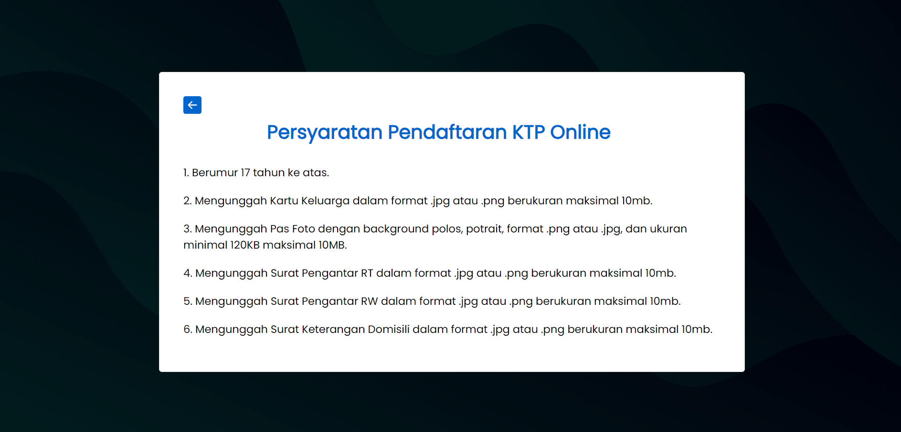
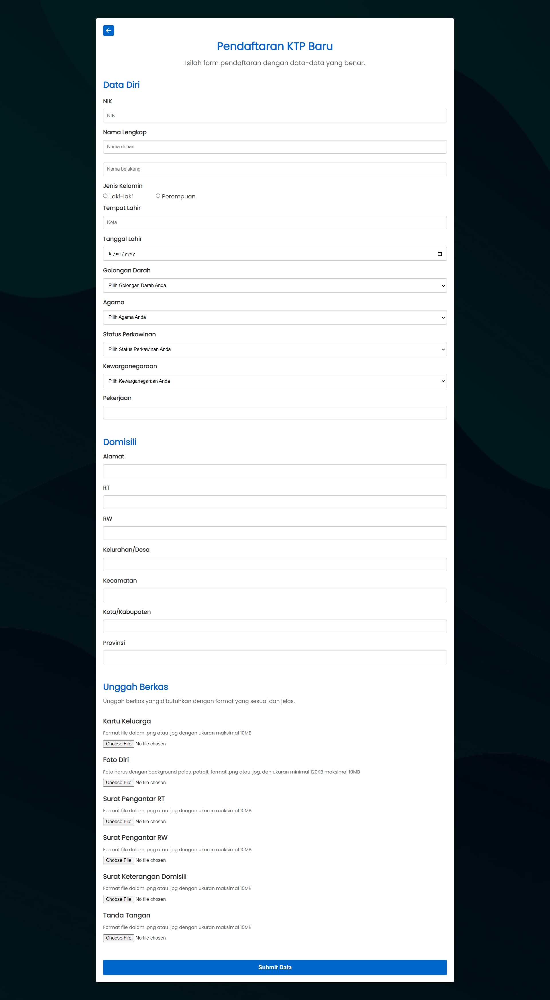

# KTP Online

This project I made for completing Human and Computer Interaction courses. Basically this is just front-end side without any back-end inside. I'm using Bootstrap 5 for the styles, and JavaScript for input logic.





## Deploy

1. Download XAMPP on your system and then run Apache services
2. Open terminal and go to htdocs on your XAMPP directory

```bash
    cd C:/xampp/htdocs
```

3. Clone this repository

```bash
    git clone https://github.com/reynaldomarchell/project-hci.git ktp
    cd ktp
```

4. Go to this link (http://localhost/ktp) to access the page.
